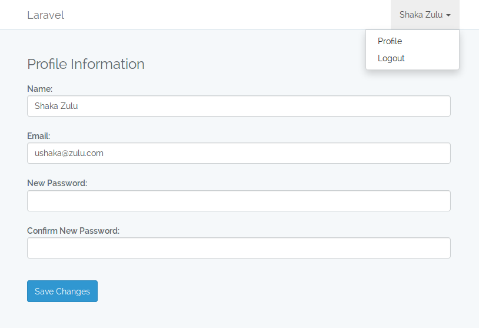

# :bust_in_silhouette: Silhouette

 A useful quick boilerplate on top of the default laravel auth scaffolding that provides an interface for users to manage their profile.

## Requirements
Basic install of Laravel 5.4 and up.
Auth scaffolding & a user to login as.

## Install
First you will need to have installed the default Laravel Auth scaffolding.

Instructions can be found [here](https://laravel.com/docs/5.4/authentication#authentication-quickstart), but basically:
``` bash
artisan make:auth
artisan migrate
```

Now you can install using Composer
``` bash
composer require twmbx/silhouette dev-master
```

If you're on Laravel 5.4:
Add the service provider to your the providers array in `config/app.php`
``` php
Twmbx\Silhouette\ServiceProvider::class,
```

Publish package assets to get
 - a ProfileController.php in `app/Http/Controllers/Auth/`
 - a profile.blade.php in `resources/views/vendor/silhouette/`
``` bash
artisan vendor:publish
```
You can customise the view as needed and use the ProfileController to add your own functionality.


In your `resources/views/layouts/app.blade.php` find  `<a href="{{ route('logout') }}"` and add the following above it:
``` html
<a href="{{ route('profile.view') }}">Profile</a>
```

## Screenshot


## Contributing

Please see [CONTRIBUTING](CONTRIBUTING.md)

## License

The MIT License (MIT). Please see [License File](LICENSE.md) for more information.

[link-packagist]: https://packagist.org/packages/twmbx/silhouette
[link-author]: https://github.com/twmbx

Made with :heart: in :zambia:
